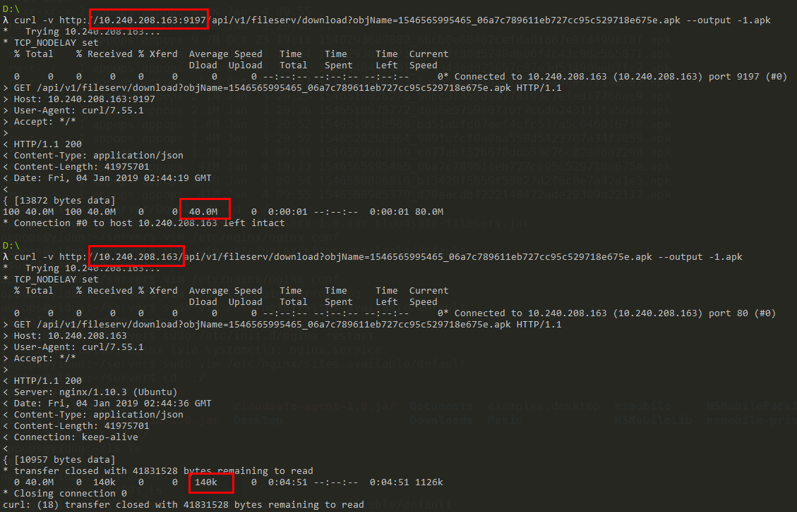

[主页](http://vonzhou.com)  | [读书](https://github.com/vonzhou/readings)  | [知乎](https://www.zhihu.com/people/vonzhou) | [GitHub](https://github.com/vonzhou)
---
# Nginx后端响应不完整问题分析
---

Nginx默认会开启proxy buffer，如果没有权限写临时文件，就会导致响应被截取。

## 场景


实现了一个简单的文件存储服务器，可以上传，下载，为了使用简单，使用了Nginx配置了端口转发，这样访问时无需包含端口信息。


```bash
wget http://10.240.208.36/api/v1/fileserv/download?objName=xxxxx.zip
```

但是今天在下载文件时发现了一个问题，一个40M的文件，下载后只有100K了，关键在于只要经过Nginx访问就不完整，直接访问后端接口就是OK的，那么问题应该出在Nginx的配置方面。




在Nginx的错误日志中有如下的错误信息：

```
2019/01/04 10:44:36 [crit] 14545#14545: *65 open() "/var/lib/nginx/proxy/5/00/0000000005" failed (13: Permission denied) while reading upstream, client: 10.240.208.36, server: _, request: "GET /api/v1/fileserv/download?objName=1546565995465_06a7c789611eb727cc95c529718e675e.apk HTTP/1.1", upstream: "http://127.0.0.1:9197/api/v1/fileserv/download?objName=1546565995465_06a7c789611eb727cc95c529718e675e.apk", host: "10.240.208.163"
```

启动Nginx的用户无权限写 /var/lib/nginx/proxy 目录，导致后续的内容无法返回，所以下载的文件不完整。

## 原理

Nginx代理缓存（[proxy_buffering](http://nginx.org/en/docs/http/ngx_http_proxy_module.html#proxy_buffering)）开启后（`proxy_buffering on`，默认是开启的），当Nginx从后端服务器收到响应后，该response的前面部分会缓存起来（可以通过`proxy_buffer_size`设置，默认是一个内存页大小，4K或者8K），如果buffer的大小无法容纳整个响应，剩下的部分会写到临时文件中，写临时文件可以通过选项 `proxy_max_temp_file_size` 和 `proxy_temp_path`控制，其中`proxy_max_temp_file_size`控制临时文件的最大大小，如果设置为0则不会写临时文件，`proxy_temp_path`设置临时文件的路径。


## 解决方案

Nginx配置，设置一个Nginx用户有权访问的临时目录：

```
proxy_temp_path /home/appops/nginx_proxy_temp 1 2;
```


也可以通过禁用掉代理响应缓存来处理这种情况：

```
proxy_max_temp_file_size 0;
```

或者

```
proxy_buffering off;
```